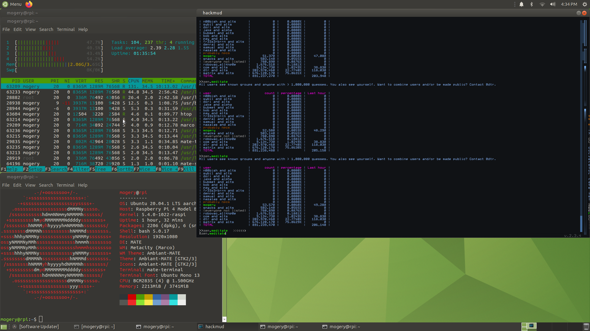

# hackmud on RPi 4
A guide to running hackmud on a Raspberry Pi 4. For support, open an issue or contact mogery#3420 on Discord.

This guide takes about an hour to complete. (45 minutes of waiting time, 10 minutes of active time)

## 0. Requirements

 * a Raspberry Pi 4 (2GB RAM might not work well, 4GB recommended)
 * an SD card (at least 16GB recommended) and reader
 * *RECOMMENDED* a heatsink or better for your RPi

## 1. OS setup

 1. Download an Ubuntu MATE **20.04** for RPi image from [this link](https://ubuntu-mate.org/download/arm64/focal/). **Make sure you download a 64-bit version!**
 2. Burn the image to your SD card. You can use [Raspberry Pi Imager](https://www.raspberrypi.com/software/) if you don't have a burning tool installed.
 3. Insert the SD card into your RPi and turn it on.
 4. Go through the Ubuntu setup. (your settings don't really matter here, but you should configure a network)
 5. You might have an issue with the setup, where at the end it will get stuck at `Waiting for unattended-upgr`. Just click Cancel, and run `sudo dpkg-reconfigure -plow unattended-upgrades` once you can open a terminal, and pick No.

## 2. Multiarch setup

 1. Run the following commands:
    ```
    sudo dpkg --add-architecture armhf
    sudo dpkg --add-architecture i386
    sudo dpkg --add-architecture amd64
    ```
    These will allow our system to download packages for other architectures.
 2. Replace `/etc/apt/sources.list` with:
    ```
    deb [arch=arm64,armhf] http://ports.ubuntu.com/ubuntu-ports/ focal main restricted universe multiverse
    deb [arch=arm64,armhf] http://ports.ubuntu.com/ubuntu-ports/ focal-security main restricted universe multiverse
    deb [arch=arm64,armhf] http://ports.ubuntu.com/ubuntu-ports/ focal-updates main restricted universe multiverse
    deb [arch=amd64,i386] http://uk.archive.ubuntu.com/ubuntu/ focal main restricted universe multiverse
    deb [arch=amd64,i386] http://uk.archive.ubuntu.com/ubuntu/ focal-security main restricted universe multiverse
    deb [arch=amd64,i386] http://uk.archive.ubuntu.com/ubuntu/ focal-updates main restricted universe multiverse
    ```
    This will tell `apt` where to find packages for all of our architectures.
 3. Run `sudo apt update`.

## 3. Dynarec setup
Dynarec is a technology that translates binaries between architectures, so that we can run executables made for x86 on armhf, or executables made for x64 on arm64. Our two dynarecs will be box86 (for x86 -> armhf) and box64 (for x64 -> arm64).

 1. Install our prerequisite packages:
    ```
    sudo apt install build-essential git cmake gcc-arm-linux-gnueabihf libc6:armhf libncurses5:armhf libstdc++6:armhf
    ```
 2. Clone the two repos:
    ```
    git clone https://github.com/ptitSeb/box86
    git clone https://github.com/ptitSeb/box64
    ```
 3. Open another terminal window or tab. In it, run the following:
    ```
    cd box86
    mkdir build; cd build;
    cmake .. -DRPI4ARM64=1 -DCMAKE_BUILD_TYPE=RelWithDebInfo
    make -j2
    sudo make install
    sudo systemctl restart systemd-binfmt
    ```
 4. In the original window, run the following in parallel:
    ```
    cd box64
    mkdir build; cd build;
    cmake .. -DRPI4ARM64=1 -DCMAKE_BUILD_TYPE=RelWithDebInfo
    make -j2
    sudo make install
    sudo systemctl restart systemd-binfmt
    ```

## 4. Steam setup

 1. Install the Steam for Linux repo with the following commands:
    ```
    wget http://repo.steampowered.com/steam/archive/stable/steam.gpg
    sudo cp steam.gpg /etc/apt/trusted.gpg.d/
    sudo tee /etc/apt/sources.list.d/steam.list <<'EOF'
    deb [arch=amd64,i386] http://repo.steampowered.com/steam/ stable steam
    deb-src [arch=amd64,i386] http://repo.steampowered.com/steam/ stable steam
    EOF
    ```
 2. Run `sudo apt update`.
 3. Install the following packages:
    ```
    sudo apt install steam-launcher:i386 libnm0 libtcmalloc-minimal4 libappindicator1:armhf libnm0:armhf libtcmalloc-minimal4:armhf libgl1-mesa-dri:amd64 libgl1-mesa-dri:i386 libgl1-mesa-glx:amd64 libgl1-mesa-glx:i386 libgl1:armhf libsdl2-2.0-0:armhf libxtst6:armhf libpulse0:armhf libbz2-1.0:armhf libsndfile1:armhf libogg0:armhf libvorbis0a:armhf libopenal1:armhf libsm6:armhf libice6:armhf libvorbisfile3:armhf libxss1:armhf libusb-1.0-0:armhf
    ```
    This will install Steam and it's dependencies.

## 5. Installing hackmud

 1. Create a `hackmud.sh` file with the following contents:
    ```bash
    #!/bin/bash
    STEAMOS=1 STEAM_RUNTIME=1 MESA_GL_VERSION_OVERRIDE=3.2 steam -applaunch 469920
    ```
    This will create a handy file for starting hackmud. Run `chmod +x hackmud.sh` to make it executable.
 2. Execute `hackmud.sh` to begin downloading hackmud. This will launch Steam. You'll need to log in here.
 3. Once hackmud has finished downloading, we can set some custom launch options.
    1. Exit Steam (you can do that by clicking on the steam icon in the top bar, and clicking on `Exit Steam`).
    2. Run `cd ~/.steam/steam/userdata/`. In here, there should be a single folder with your user ID. `cd` into it.
    3. Start editing `config/localconfig.vdf`. Locate the `UserLocalConfigStore/Software/Valve/Steam/apps/469920` tag.
    4. Create a new value inside named `LaunchOptions`. Give it a value of `-force-glcore32` and whatever other launch options you want the game to have. (I personally like `-screen-fullscreen 0 -screen-height 720 -screen-width 1280`.)

## 6. Done!
To launch hackmud, just run the `hackmud.sh` file we created. The startup takes a while: going from steam being closed to the hackmud intro animation takes about 2 minutes, and it will pin the CPU for a while. But after that, it should work just fine.

